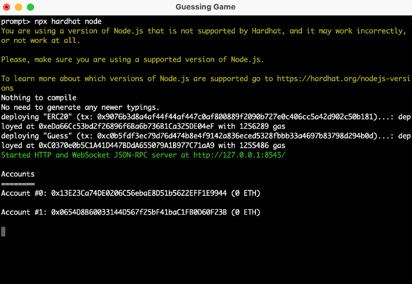
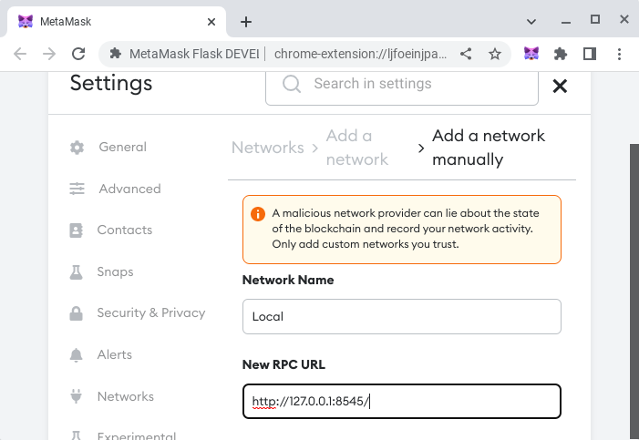
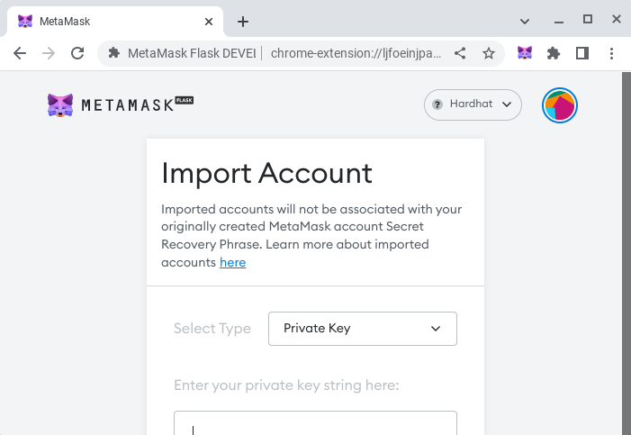
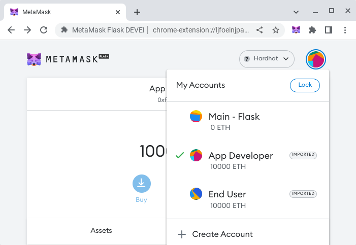
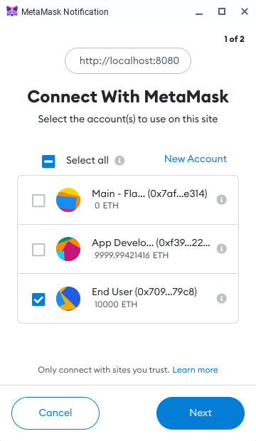
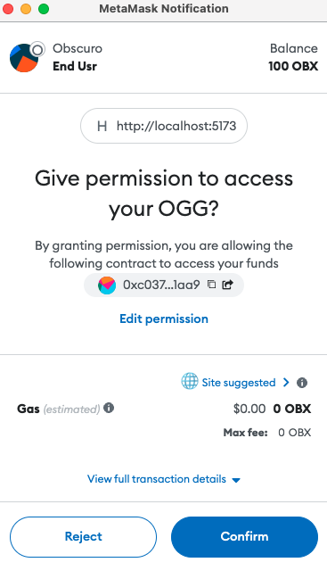
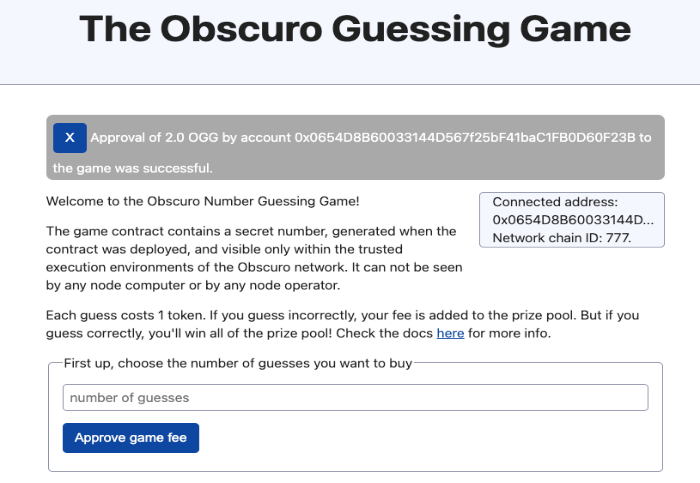
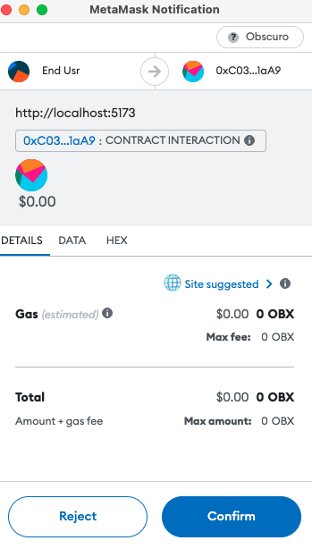
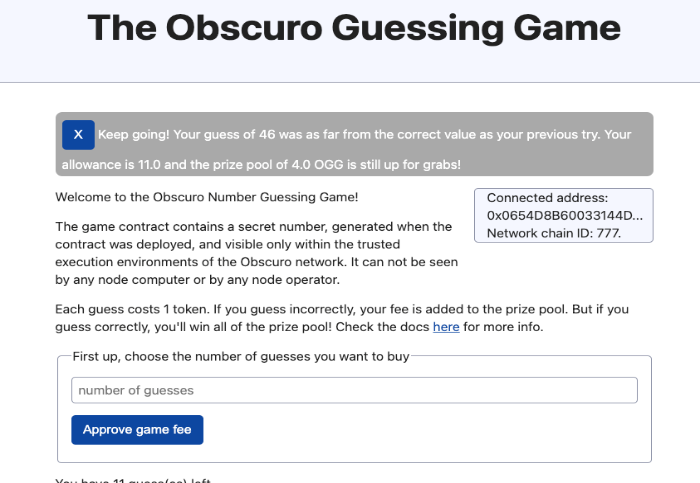

# Example Number Guessing Game (v1)

## Introduction
This project demonstrates a basic TEN use case, which is a simple number guessing game. The contract generates a 
random secret number when it's deployed, which is never revealed to an operator or end-user because of the privacy 
benefits of TEN. The goal of the game is to guess this number, and each time an attempt is made, an entrance fee of 
1 token is paid. If a user correctly guesses the number, the contract will pay out all of the accumulated entrance 
fees to them, and reset itself with a new random number.

Without TEN, it would be possible to look up the internal state of the contract and cheat, and the game wouldn't work. 

The contract functionality comes with two contracts; a basic ERC20 contract which allows the user to hold assets and 
pay the entrance fee to the game, and the game contract itself. This includes a test for that contract, and a sample 
script that deploys that contract.

## Environment Setup
The following steps are required:
1. Clone this repository into a suitable folder.
2. Install NPM and NPX, and ensure they are running correctly. This is outside the scope of this project.
3. Install NPM packages specified in `package.json` by running:
```shell
npm install
npm install hardhat@esm
```
4. Hardhat and its dependencies will have been installed in the previous step. More details are available at 
https://hardhat.org/hardhat-runner/docs/getting-started#overview. Once Hardhat is installed, try running some of the 
following tasks:
```shell
npx hardhat compile
npx hardhat clean
npx hardhat help
```
5. A `.env` file should be created in the project root containing the private keys of the two accounts used by the 
sample, `APP_DEV_PK` and `APP_USR_PK`. Should you wish to deploy the game against TEN or Sepolia, the Token 
returned from joining the network using the gateway and the Sepolia API key should be supplied respectively, 
e.g. 
```shell
APP_DEV_PK=<pk>
APP_USR_PK=<pk>
TOKEN=<key>
API_KEY=<key>
```

## Running the game against a Hardhat Network
1. Starting Hardhat with `npx hardhat node` will start a local hardhat network and will deploy the ERC20 token and game 
contracts. You should take notice of the contract addresses for later. 



2. Set up Metamask with the Hardhat network on `http://127.0.0.1:8545/` with chain ID 1337. 



3. If not already done, import the accounts into Metamask using the private keys from the `.env` file. Note that you 
may have to clear activity and nonce data in metamask if you have previously used these accounts against hardhat 
or any other network. 



4. Rename the accounts to be more user-friendly.



5. Edit the [index.ts](./src/index.ts) file to ensure the correct contract addresses are being used. Once done, start
the user interface for the game using `npm run dev`.


6. The app is not initially connected to Metamask, and when the page first loads, it should prompt Metamask to pop up 
and seek connection wth the end-user account (you might want to first completely close your browser before performing). 
You should approve this.



7. After connection, the user interface should now show the address of the game contract and be ready to play. Before 
playing you must approve the ERC20 contract to allow the game to spend your tokens, using the approve facility on the 
user interface. 


8. Approve the game for the number of guesses you want to perform.

 

9. Submit a guess and see if you're correct!

 

## Running the game against the Sepolia Network
Running the game against Sepolia follows the same steps as for running against a local Hardhat network. You should first 
update the keys to use in the [dotenv](./.env) file to values unique to your accounts on Sepolia and add in the API key 
to use. Funds should be available on both accounts and can be obtained using the [Sepolia faucet server](https://sepoliafaucet.com/). 

1. Set up Metamask with the Sepolia network as described [here](https://www.alchemy.com/overviews/how-to-add-sepolia-to-metamask).

2. Deploy the contracts using `npx hardhat deploy --network sepolia` and take a note of the contract addresses from the 
console.

3. Update the contract addresses `ERC20_ADDRESS` and `GUESS_ADDRESS` in [index.ts](./src/index.ts).

4. Follow the steps as described previously to approve tokens to the game, and to make a guess!


## Running the game against a TEN Network
Because TEN uses the same tools and EVM as Ethereum itself, it should be possible to replay the previous steps with 
TEN's Testnet. As Testnet is not ephemeral for running development like HardHat, you should update the keys to use 
in the [dotenv](./.env) file to values unique to you. Also once you have joined the TEN network through the gateway, 
you should update the `.env` file for the token for the connection.

1. Set up Metamask with the TEN network as described [here](https://docs.ten.xyz/docs/getting-started/for-users/setup-you-wallet).

2. Request OBX funds for the two accounts using the [token faucet](https://docs.ten.xyz/docs/getting-started/for-users/get-tokens).

3. Deploy the contracts to the TEN Testnet using `npx hardhat deploy --network ten`. Take a note of the contract
addresses from the console. 

4. Confirm and update the contract addresses `ERC20_ADDRESS` and `GUESS_ADDRESS` in [index.ts](./src/index.ts).

5. Follow the steps as described previously to approve tokens to the game, and to make a guess!

